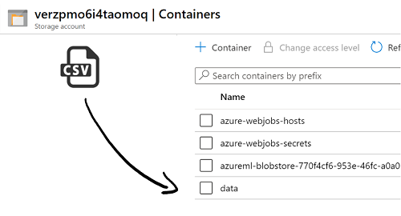

# Data Preparation Pipeline
This documentation helps you to understand the data preparation pipeline, how to bring your own data into the system and describes the required file structure.


The purpose of the pipeline is twofold: 1) It automatically processes supported documents that are put into the "data" container of the created Azure Storage. 2) It creates a REST endpoint that can be used to convert documents (like images, PDFs) into text.

1. If you put files in the storage account "data" container, the files are processed and put in Cosmos DB following the standardized output format. For testing purpose you may use this [Sample CSV-file](../.attachments/sample.csv) or a [Sample JSON-file](../.attachments/sample.json). Have a look at the standard JSON structure supported by Verseagility:
```json
{
    "question": {
        "title": "Any way to force the August 3 updates to the SP4 after the Win10 Anniversary Update?",
        "author": "Ed Hansberry (work acct)",
        "createdAt": "Created on August 5, 2016",
        "text": "There is a big warning/alert in this forum to apply the August 3 Surface Pro 4 updates after upgrading to the Windows 10 Anniversary update.I updated to that yesterday, but I continue to check Windows Updates and it says there is nothing available, other than the occasoinal Windows Defender updates.Any ideas how to force it? Kind of frustrating they are throttling the update on the one hand and telling you to apply it as soon as you upgrade on the other.",
        "upvotes": 1
    },
    "id": "49f70573ff76458f823b605d88798c18",
    "views": 39,
    "appliesTo": "Surface,Surface Pro 4,Install, update, and repair",
    "url": "https://answers.microsoft.com/en-us/surface/forum/all/any-way-to-force-the-august-3-updates-to-the-sp4/f2758bea-38b8-476b-9017-1b9017b4970d",
    "language": "en-us",
    "answer": {
        "markedAsAnswer": "false",
        "createdAt": "Replied on August 5, 2016",
        "text": "Go to http://www.microsoft.com/en-us/download/details.aspx?id=49498 and download and run the latest MSI then restart.",
        "upvotes": 0
    }
}
```



What happens in the background is that the "processor-function" gets triggered. This function takes the newly added blob and parses it based on the content/MIME-type of the blob. To tell the function how a certain document has to be handled, you must write your own parser, parsers are stored in the /parsers directory. By default, three parsers are already implemented (CSV, JSON and default). If you take a look at e.g. csv-parser, you see that the job of the parser is to map content of the CSV file to an object called "OutputSchema". OutputSchema is the document schema that will be used to store the document in Cosmos DB (of course you can also adopt the schema to fit your needs). For example, if your CSV file contains a list of documents and the ID in the first column (index 0), the number of views for this document in the second column and the URI to the document in the third column, the parser iterates over all rows and maps all columns to the right OutputSchema properties:


Note: If you want to link attachments to the documents in the CSV file, create a container in the storage account named after the document ID. The pre-implemented parser will search in the storage for any container that has the same ID as the document. If it finds one, it links all blobs in the container as attachments to the document.

2. If no matching parser is implemented, the default-parser will be used. It forwards the document to another function called "documentconverter-function". The document converter can also be called manually by performing the following HTTP request:
`POST https://myfunctionapp.azurewebsites.net/documentconverter?code=[function-key]`
The content of the HTTP request is of type application/json and is a single object containing the properties "name" (the name of the document), "content" (the binary file encoded as base64 string) and "contentType" (MIME-Type). It may look like this:
```javascript
{
  "name": "sample.pdf",
  "content": "JVBERi0xLjUKJY8KOCAwIG9iag[...]",
  "contentType": "application/pdf"
}
```

The job of the document converter-function is to return an XML document containing the textual representation of the binary file. If the passed file is a PDF, the text of the PDF is returned (embedded in an XML structure). If the file is an image, OCR will be performed and the result is returned.

3. If you want to store documents for scoring, the "api-function" can be used. It accepts "application/json" HTTP requests and stores the documents described in the HTTP body in Cosmos DB following the "OutputSchema". It also parses linked attachments that are stored in the storage account that was created during deployment. You can call the API by using
`POST https://myfunctionapp.azurewebsites.net/api/score?code=[function-key]`

The HTTP request body may look like this
```javascript
{
  "subject": "Document subject",
  "body": "Document content and text",
  "attachments": [
    {
      "link": "https://mystorageaccount.blob.core.windows.net/attachments/sample.pdf"
    }
  ]
}
```

The function will parse sample.pdf and add the content of the PDF as well as the other properties (subject and body in this case) to the Cosmos DB collection.

[<< Previous Page](Setup.md) --- [Next Page >>](Project-Setup.md)
