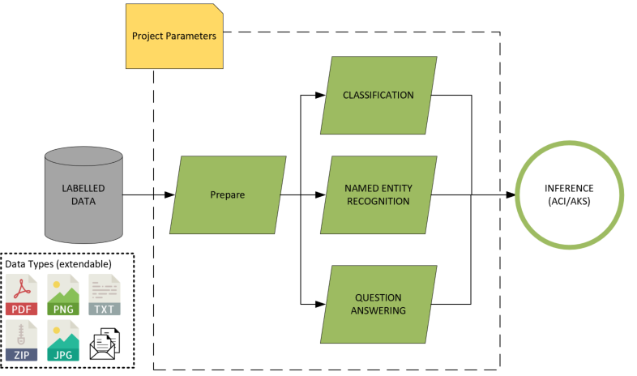

# Verseagility Setup
This part of the documentation helps you to set up Verseagility in our own subscription and with your data. Each of the points below will lead you to the respective documentation page. At the bottom of each page you will find a link to the previous and next page.

1. [Setup](Verseagility-Setup/Setup.md)
2. [Pipeline Customization](Verseagility-Setup/Customize-Pipeline.md)
2. [Project Setup](Verseagility-Setup/Project-Setup.md)
3. [Data Preparation](Verseagility-Setup/Prepare-Data.md)
4. [Training - Classification](Verseagility-Setup/Train-Classification.md)
5. [Training - Named Entity Recognition](Verseagility-Setup/Train-NER.md)
6. [Training - Question/Answering](Verseagility-Setup/Train-QA.md)
7. [Deployment](Verseagility-Setup/Deploy-Service.md)

# Overview

There are three main components to Verseagility:
1. Data processing pipeline
1. Task modeling
1. Deployment

## Data Processing Pipeline
The NLP pipeline will standardize the data into a extenible JSON format, from which data preparation and training steps are initiated. These result in custom models for the pre-defined tasks, which can be deployed in a single container instance on ACI or AKS.

### Supported document types
PDF, Word Document, .txt, Power Point, ...

## Task Modeling

The starting point for each project with Verseagility, is the project configuration (/project/\*.config.json). The configuration defines what tasks need to be addressed using the NLP toolkit.

### Supported task types
- Text/Document classification
- Named Entity Recognition
- Question Answering

Example use cases:
- Automated support ticket processing (answer suggestion, automatic routing)
- Automated ERP/CRM workflows (extraction of entities from text to auto-complete fields)
- Chatbot extension, with custom classification and entity extraction

### Supported languages
Versegaility was developed to be as language agnostic as possible. This means that the most common languages are supported (and have been tested) out of the box, while new languages require only minor adjustments to the toolkit.

Validated languages include:
|Shortcut|Language|
|--|--|
|en| English (US)|
|de|German|
|fr|French|
|es|Spanish|
|it|Italian|

Further languages are supported with multi-language pre-trained models or required minor additions to the pre-processing and pre-trained model loading. See the [FAQ](/docs/FAQ.md) for details.
